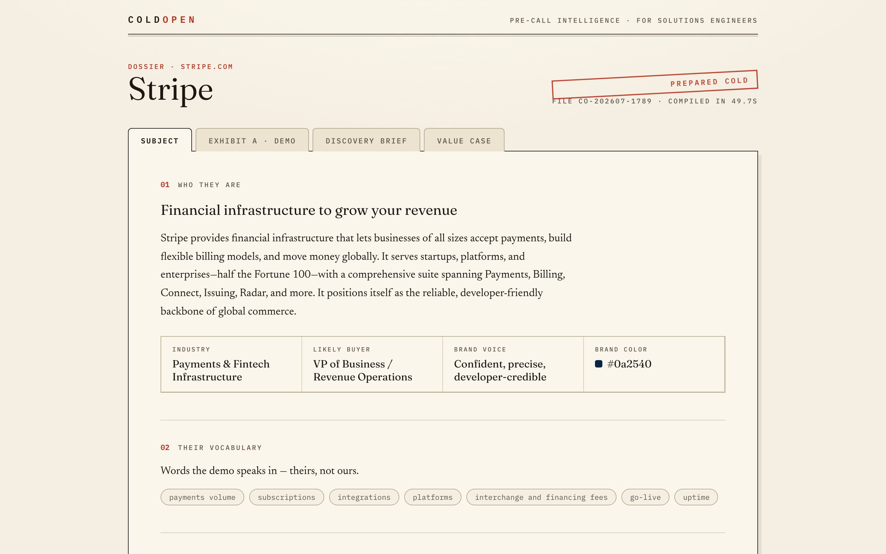
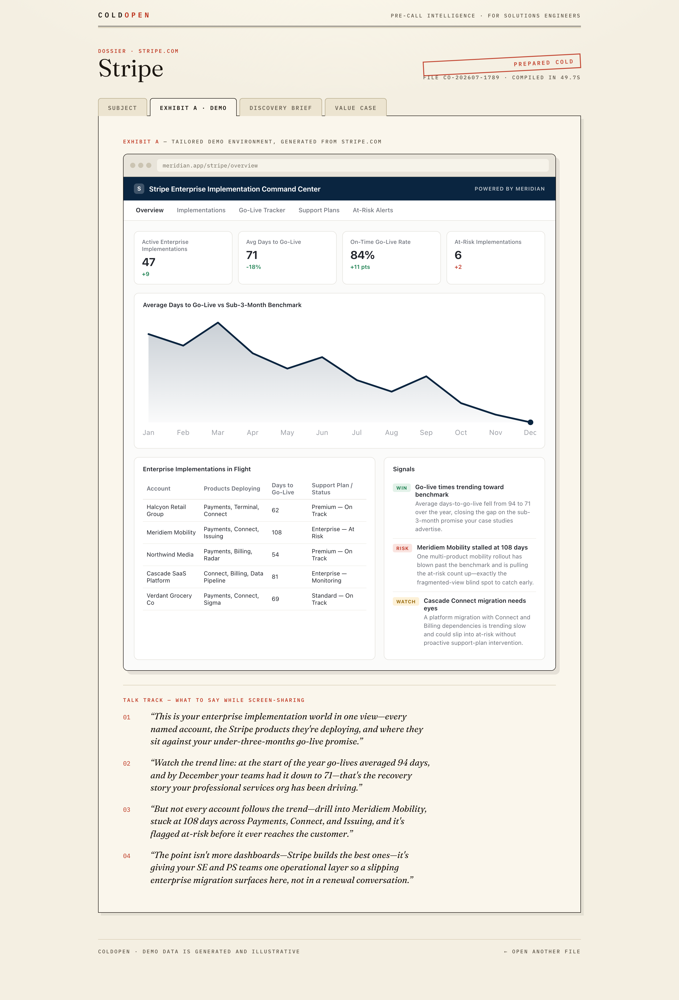

# 🎬 ColdOpen

**The demo before the first call.**



Solutions engineers lose hours per prospect building tailored demos and pre-call research — and most first calls still open with a generic product tour. ColdOpen compresses that prep into about a minute: paste a prospect's website, and it hands you everything an SE needs to walk in warm.

**One URL in →**

1. **A sales thesis** — how to position for *this* prospect, what world the demo must depict, and the #1 trap to avoid. Generated first; everything downstream is bound to it.
2. **A tailored demo environment** — a fictional B2B SaaS ("Meridian") re-skinned live with the prospect's brand color, their vocabulary, and twelve months of plausible, industry-native sample data — plus a four-beat **talk track** telling the SE exactly what to say while screen-sharing. Rendered as "Exhibit A" in a browser frame.
3. **A discovery brief** — a pre-call read on the account, three testable pain hypotheses, five discovery questions (with *why each one matters*), landmines to avoid, and a positioning angle against their status quo.
4. **A value case** — three conservative ROI drivers with stated assumptions, a payback estimate, and an honest disclaimer that the numbers are directional.

Exhibit A, generated from nothing but `stripe.com` — Stripe's brand color, Stripe's vocabulary, and a talk track for the screen-share:



## Why this is interesting (the business case)

- Demo personalization is what SE teams pay Walnut / Demoboost / Reprise for — but those tools personalize *recordings and tours*. ColdOpen generates a **live, branded environment from nothing but a URL**.
- The SE interview process at companies like Salesforce is literally "here's a fictional client, build a tailored demo in 48 hours." ColdOpen is that exercise, automated.
- Prep time per prospect drops from ~2–3 hours of manual research and demo-data seeding to ~60 seconds.

## Architecture

```
frontend/   React 18 + TypeScript + Vite — custom "paper dossier" design system
            (no component library; hand-rolled CSS + SVG charts)
backend/    FastAPI + httpx + BeautifulSoup + Anthropic API
            ├── scraper: homepage (+ /about) → compact research packet
            └── analyst: strategist pass (profile + sales thesis), then two
                parallel builder passes (demo, brief + ROI) bound to the thesis
```

Design decisions worth noting:

- **AI output is schema-enforced, not parsed.** Every field the UI renders is a Pydantic model passed to Anthropic structured outputs (`messages.parse`). The model can't return a malformed dossier — validation is guaranteed before anything reaches the frontend.
- **A strategist pass keeps parallel generations honest.** Early versions ran the demo builder and brief writer as independent parallel calls — and on software-company prospects they could contradict each other (the brief would warn "don't pitch analytics to an analytics company" while the demo cloned the prospect's own product). Now a first pass produces a binding *sales thesis* that both builders receive, plus explicit data-consistency rules (an insight may never contradict a KPI delta). The builders still run in parallel.
- **The full dossier can't be one call anyway** — its schema exceeds the API's compiled-grammar size limit, which is what forced the multi-call design in the first place.
- **Grounded, not hallucinated.** The prompt forbids inventing company facts not present in the scraped text; inference beyond the page must be conservative and industry-level. ROI output carries a mandatory disclaimer field.
- **Graceful scraping.** Redirect-following, JS-heavy/bot-blocked sites detected and reported cleanly, optional /about enrichment that contributes nothing on failure.
- **Deliberately non-generic UI.** The interface is a paper dossier — cream stock, ink serif, rubber-stamp red, mono microlabels — while the generated demo inside "Exhibit A" switches to a modern product aesthetic in the prospect's own brand color. The contrast is the point.

## Running it

**Backend**

```bash
cd backend
python3 -m venv .venv && .venv/bin/pip install -r requirements.txt
cp .env.example .env   # add your ANTHROPIC_API_KEY
.venv/bin/uvicorn app.main:app --port 8010
```

**Frontend**

```bash
cd frontend
npm install
npm run dev            # http://localhost:5180 (proxies /api to :8010)
```

Then paste any company's URL — try `stripe.com` — and open the file.
